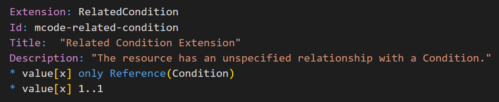

Because FHIR Shorthand files are pure text, authors can use any text editor to create FSH content. However, if you choose the popular (and free) [Visual Studio Code (VS Code)](https://code.visualstudio.com/) editor, there is a FSH-specific extension that can greatly enhance your productivity through syntax highlighting, helping you navigate, and even running SUSHI and navigating directly to errors.

The [VS Code FSH extension](https://marketplace.visualstudio.com/items?itemName=FHIR-Shorthand.vscode-fsh) (formally, MITRE-Health.vscode-language-fsh) offers the following features:

* **Syntax highlighting.** Colorizing FSH text allows easier reading and writing of FHIR Shorthand.
* **Autocomplete.** This feature makes contextually appropriate suggestions after when specifying a nested path, the `Parent` keyword, and when writing `obeys` rules.
* **Tasks.** The extension allows you to run SUSHI and check your work inside the VS Code environment. SUSHI's log messages go to the integrated Terminal tab, and errors go to VS Code's Problems tab. Selecting an error or warning will navigate directly to the line or area of code responsible for the error or warning.
* **Go to Definition.** This feature allows quick navigation to the definition of an item, anywhere the name of the item is used. If it is a native FHIR item, the link to the documentation page is offered.
* **Snippets.** This feature automatically adds relevant keywords and placeholders so you can easily enter all of the recommended metadata for a FSH definition.

Here is an example of syntax highlighting:

## Installation

To install VS Code on macOS, Windows, or Linux, follow the [instructions here](https://code.visualstudio.com/Download).

To install the FHIR Shorthand extension, run VS Code, and navigate to `View > Extensions` or select the icon on the far left that looks like four little squares. Then search for "FHIR Shorthand" and make sure you pick the extension with the fish icon, "FHIR Shorthand (FSH) Language Support by MITRE". Click on the associated gear icon and then "install".

## Full Documentation

Full documentation for the FHIR Shorthand language extension for VS Code can be [found here](https://github.com/standardhealth/vscode-language-fsh#readme). Once installed in VS Code, the documentation can be accessed by clicking on the installed FHIR Shorthand extension (look for the fish icon on the Extensions pane on the left navigation bar).
